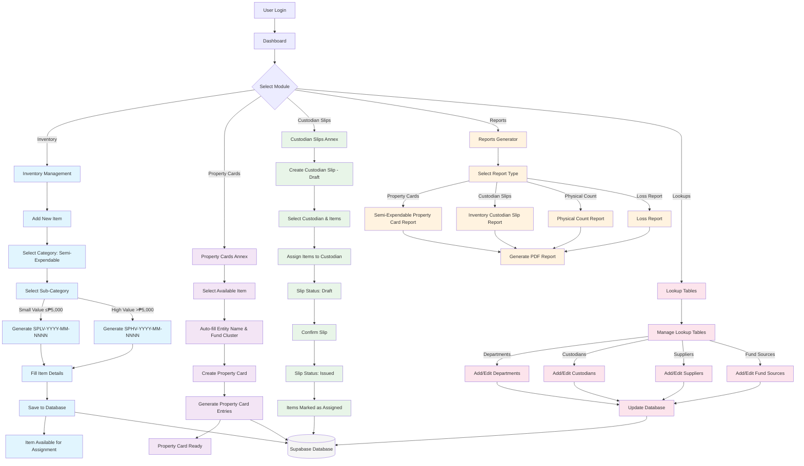
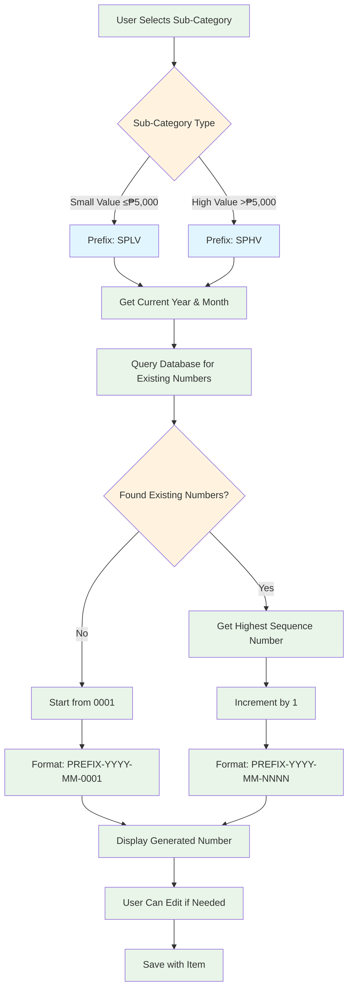
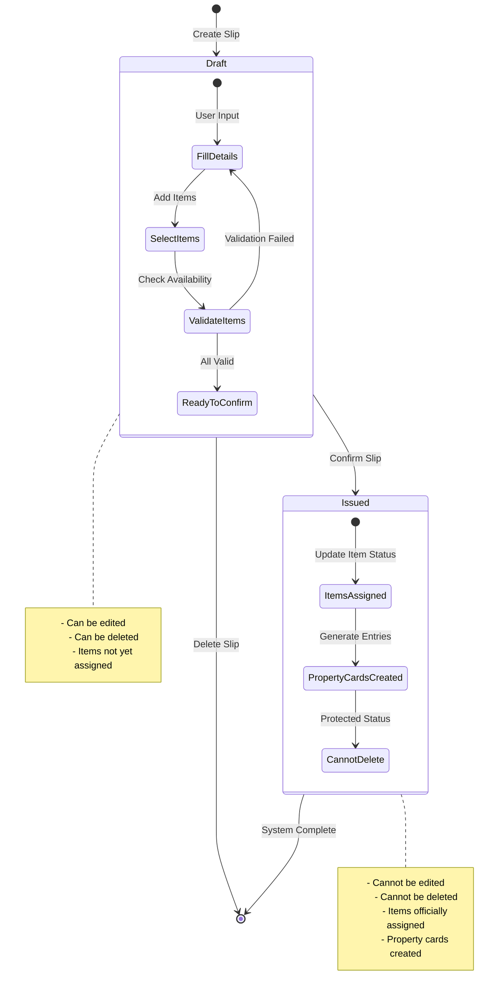
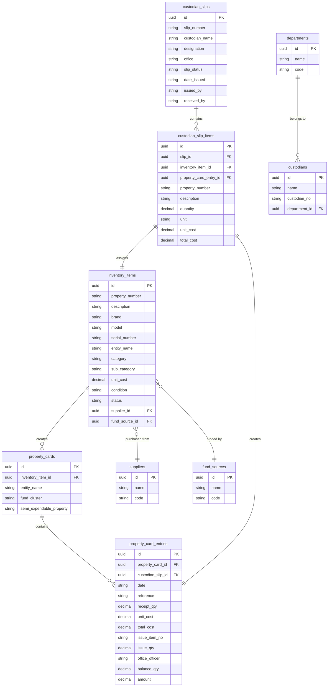
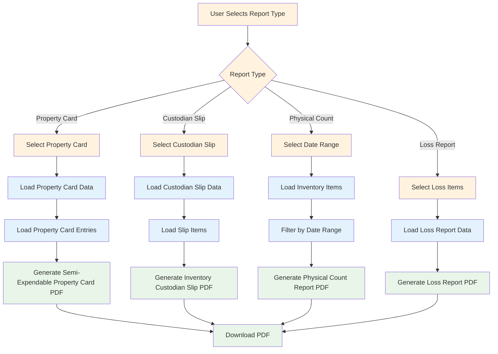

# Semi-Property Guardian System Flowchart

## Main System Flow

## Detailed Data Flow

```mermaid
flowchart LR
    subgraph "Inventory Creation"
        A1[User Input] --> A2[Category Selection]
        A2 --> A3[Sub-Category Selection]
        A3 --> A4[Auto-Generate Property Number]
        A4 --> A5[Fill Item Details]
        A5 --> A6[Validation]
        A6 --> A7[Save to inventory_items]
    end
    
    subgraph "Property Card Creation"
        B1[Select Inventory Item] --> B2[Auto-fill Entity Name]
        B2 --> B3[Auto-fill Fund Cluster]
        B3 --> B4[Create Property Card]
        B4 --> B5[Generate Initial Entry]
        B5 --> B6[Save to property_cards]
    end
    
    subgraph "Custodian Assignment"
        C1[Create Custodian Slip] --> C2[Select Items]
        C2 --> C3[Assign to Custodian]
        C3 --> C4[Update Item Status]
        C4 --> C5[Create Property Card Entries]
        C5 --> C6[Mark Slip as Issued]
    end
    
    A7 --> B1
    B6 --> C1
    C6 --> B6
    
    %% Database Tables
    A7 -.-> DB1[(inventory_items)]
    B6 -.-> DB2[(property_cards)]
    C6 -.-> DB3[(custodian_slips)]
    C6 -.-> DB4[(custodian_slip_items)]
    
    classDef process fill:#e3f2fd
    classDef database fill:#f5f5f5
    
    class A1,A2,A3,A4,A5,A6,A7,B1,B2,B3,B4,B5,B6,C1,C2,C3,C4,C5,C6 process
    class DB1,DB2,DB3,DB4 database
```

## Property Number Generation Flow

## Custodian Slip Workflow

## Database Schema Relationships

## Report Generation Flow

This flowchart shows the complete system flow including:

1. **Main System Flow** - Overall user journey through different modules
2. **Detailed Data Flow** - How data moves between inventory, property cards, and custodian slips
3. **Property Number Generation** - The automatic numbering system based on sub-category
4. **Custodian Slip Workflow** - The two-step process (Draft → Issued)
5. **Database Schema** - Entity relationships and data structure
6. **Report Generation** - How different reports are generated

The system follows a clear progression: **Inventory Creation** → **Property Card Generation** → **Custodian Assignment** → **Report Generation**, with proper data validation and status tracking throughout.
